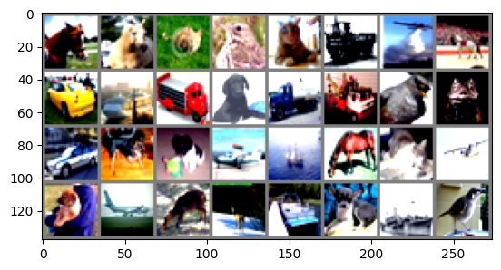

# CIFAR-10 Image Classification with Convolutional Neural Networks

## Objective

The objective of this project is to experiment with different Convolutional Neural Network (CNN) architectures for image classification on the CIFAR-10 dataset. This involves varying aspects such as the use of pooling layers, fully connected layers, different kernel sizes, and number of channels. The goal is to evaluate the performance of these architectures based on metrics such as accuracy and precision.

## Dataset

The CIFAR-10 dataset consists of 60,000 32x32 color images in 10 classes, with 6,000 images per class. There are 50,000 training images and 10,000 test images. The classes are:

0. airplane
1. automobile
2. bird 
3. cat
4. deer
5. dog
6. frog
7. horse
8. ship
9. truck

Sample data from the CIFAR-10 dataset:



## Steps

1. Load and preprocess the CIFAR-10 dataset
2. Implement different CNN architectures
3. Train the CNN models
4. Evaluate the trained models on the test set
5. Compare the performance of different architectures

## Loading and Preprocessing the Dataset

The CIFAR-10 dataset is loaded using the `torchvision` library in PyTorch. The images are normalized and transformed to tensors. The dataset is split into training and test sets, and data loaders are created with a specified batch size.

```python
class CIFAR10DataModule(pl.LightningDataModule):
    def __init__(self, batch_size=32):
        super().__init__()
        self.batch_size = batch_size
        self.transform = transforms.Compose([
            transforms.ToTensor(),
            transforms.Normalize((0.4914, 0.4822, 0.4465), (0.247, 0.243, 0.261))
        ])

    def prepare_data(self):
        # Download CIFAR-10 dataset
        CIFAR10(root="data", train=True, download=True)
        CIFAR10(root="data", train=False, download=True)

    def setup(self, stage=None):
        # Split dataset into train and validation sets
        if stage == 'fit' or stage is None:
            cifar_full = CIFAR10(root="data", train=True, transform=self.transform)
            self.cifar_train, self.cifar_val = random_split(cifar_full, [45000, 5000])

        if stage == 'test' or stage is None:
            self.cifar_test = CIFAR10(root="data", train=False, transform=self.transform)

    def train_dataloader(self):
        return DataLoader(self.cifar_train, batch_size=self.batch_size, shuffle=True)

    def val_dataloader(self):
        return DataLoader(self.cifar_val, batch_size=self.batch_size)

    def test_dataloader(self):
        return DataLoader(self.cifar_test, batch_size=self.batch_size)
```

## Implementing a CNN

Several CNN architectures are implemented using the PyTorch framework. Each architecture consists of convolutional layers, pooling layers, and fully connected layers. The architectures vary in depth, number of filters, and regularization techniques.

### Architecture 1: Moderate Depth with Dropout

- Three convolutional layers with increasing number of filters (32, 64, 128) and kernel size of 3x3 with padding of 1
- Max pooling layers after each convolutional layer with pool size of 2x2 
- Flatten layer to convert the feature maps into a 1D vector
- Two fully connected layers with 512 and 10 units respectively
- Dropout layer with a probability of 0.5 after the first fully connected layer

### Architecture 2: Simplicity and Efficiency

- Two convolutional layers with 32 and 64 filters respectively and kernel size of 3x3 with padding of 1
- Max pooling layer after the second convolutional layer with pool size of 2x2
- Flatten layer to convert the feature maps into a 1D vector 
- Two fully connected layers with 256 and 10 units respectively
- Dropout layer with a probability of 0.5 after the first fully connected layer

### Architecture 3: Enhanced Feature Normalization 

- Four convolutional layers with 32, 32, 64, and 64 filters respectively and kernel size of 3x3 with padding of 1
- Batch normalization layers after each convolutional layer
- Max pooling layers after the third and fourth convolutional layers with pool size of 2x2
- Flatten layer to convert the feature maps into a 1D vector
- Two fully connected layers with 256 and 10 units respectively 
- Dropout layer with a probability of 0.5 after the first fully connected layer

### Architecture 4: ResNet with BasicBlocks

- ResNet architecture with BasicBlock as the building block
- Three layers: layer1, layer2, and layer3 with increasing number of filters (16, 32, 64) and stride of 1, 2, 2 respectively
- Each layer consists of a specified number of BasicBlocks (2, 2, 2 in this case)
- BasicBlock contains two convolutional layers with batch normalization and ReLU activation
- Shortcut connection is added to the BasicBlock to enable residual learning
- Global average pooling is applied after the last layer
- Fully connected layer with 10 units for classification

## Training CNN

The CNN models are trained using the training set. The training process involves:

- Defining the loss function (e.g., cross-entropy loss)
- Initializing the optimizer (e.g., Adam optimizer)
- Iterating over the training data in batches
- Forward pass: computing the model's predictions
- Calculating the loss between the predictions and the true labels
- Backward pass: computing gradients and updating the model's parameters
- Monitoring the training loss and accuracy

```python
def forward(self, x):
        out = F.relu(self.bn1(self.conv1(x)))
        out = self.layer1(out)
        out = self.layer2(out)
        out = self.layer3(out)
        out = F.avg_pool2d(out, 8)  # Global Average Pooling
        out = out.view(out.size(0), -1)  # Flatten the output
        out = self.linear(out)
        return out

def training_step(self, batch, batch_idx):
    images, labels = batch
    outputs = self(images)
    loss = F.cross_entropy(outputs, labels)
    self.train_losses.append(loss)
    self.log('train_loss', loss)
    self.log('train_acc', self.accuracy(outputs, labels))
    return loss
```

Loss plot for ResNet with BasicBlocks (Architecture 4):


## Evaluating Model

The trained models are evaluated on the test set to measure their performance. The evaluation metrics include:

- Accuracy: the percentage of correctly classified images
- Loss: the average loss value on the test set
- Precision: the proportion of true positive predictions among the positive predictions
- Recall: the proportion of true positive predictions among the actual positive instances
- F1 score: the harmonic mean of precision and recall

```python
def validation_step(self, batch, batch_idx):
        images, labels = batch
        out = self(images)
        loss = F.cross_entropy(out, labels)
        acc = accuracy(out, labels, task="multiclass", num_classes=10)
        self.log('val_loss', loss)
        self.log('val_accuracy', acc)
```

## Results

### Architecture 1: Moderate Depth with Dropout
- Average training loss: 0.9802
- Validation loss: 0.8916 
- Validation accuracy: 68.26%

### Architecture 2: Simplicity and Efficiency
- Average training loss: 0.8396
- Validation loss: 0.8115
- Validation accuracy: 70.68%

### Architecture 3: Enhanced Feature Normalization
- Average training loss: 0.6413
- Validation loss: 0.6561
- Validation accuracy: 77.68%

### Architecture 4: ResNet with BasicBlocks
- Validation loss: 0.5208
- Validation accuracy: 80.80%  
- Validation F1 score: 0.7875
- Validation precision: 0.8120
- Validation recall: 0.8080


### Test Set Performance on the Best Model (Architecture 4)
- Test loss: 0.5851
- Test accuracy: 78.35%
- Test F1 score: 0.7608  
- Test precision: 0.7854
- Test recall: 0.7835

## Conclusion

In this project, we implemented and compared different CNN architectures for image classification on the CIFAR-10 dataset. The ResNet architecture with BasicBlocks (Architecture 4) achieved the best performance with a test accuracy of 78.35% and an F1 score of 0.7608. The use of residual learning, deeper architecture, and global average pooling contributed to its superior performance compared to the other architectures.

The project demonstrates the effectiveness of CNNs for image classification tasks and highlights the importance of architecture design choices. Further improvements can be explored by fine-tuning hyperparameters, using data augmentation techniques, or experimenting with other advanced CNN architectures.


## References

[1] [Convolution Neural Network by Coding Lane](https://youtube.com/playlist?list=PLuhqtP7jdD8CD6rOWy20INGM44kULvrHu&si=Q40tqZJVGNIX_e2P)


[2] [Residual Networks and Skip Connections (DL 15) by Professor Bryce](https://www.youtube.com/watch?v=Q1JCrG1bJ-A)


